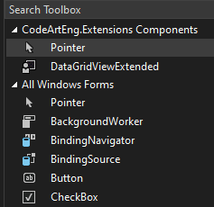

# DataGridViewEx: Enhancing Windows Forms DataGridView

## Introduction

The `DataGridViewEx` class is an extension class for the Windows Forms `DataGridView` control. It adds several useful features that make data editing more efficient and user-friendly. This article explains the main features of `DataGridViewEx` and provides usage examples.

To activate extended features for a `DataGridView` object, call the `EnableAdvanceControl` method or any other public method in the `DataGridViewEx` class.

```csharp
DataGridView myDataGridView = new DataGridView();
myDataGridView.EnableAdvanceControl();
```

Alternatively, create `DataGridVewExtended` object directly from Visual Studio Toolbox.


## Key Features
### 1. Change Tracking

`DataGridViewEx` keeps track of modifications made to cells in the `DataGridView`.

- You can easily see which cells have been changed.
- Changes can be committed or reverted as needed.

After making changes to the grid:

```csharp
// Check if there are uncommitted changes
if (myDataGridView.HasChanges())
{
    // Commit all changes
    myDataGridView.CommitChanges();

    // Or revert all changes
    myDataGridView.RevertChanges();
}
```
Modified cells are highlighted with a different background colour (default is light yellow). You can also change the default colour used to highlight modified cells:

```csharp
myDataGridView.SetModifiedCellColor(Color.LightBlue);
```

### 2. Smart Editing

The class adds several keyboard shortcuts to speed up data entry:

- **Ctrl+D**: Copy values down in selected cells
- **Ctrl+R**: Copy values right in selected cells
- **Ctrl+V**: Enhanced paste from clipboard
- **Delete**: Clears content of selected cells (without deleting the entire row)

### 3. Enhanced Clipboard Operations

The paste function in `DataGridViewEx` is significantly improved to handle multi-cell clipboard content more efficiently. It can intelligently paste single values across multiple selected cells or distribute multi-cell content starting from the top-left of the selection. The function respects the `DataGridView` boundaries, handles different data types appropriately (including boolean values for checkbox columns), and maintains the structure of copied data.


## Benefits

1. **Improved User Experience**: Users can easily see which cells they've modified.
2. **Error Prevention**: The ability to revert changes helps prevent accidental data modifications.
3. **Efficient Editing**: Keyboard shortcuts and smart pasting make data entry faster.
4. **Better Control**: Developers have more control over the editing process and can manage changes programmatically.

## Conclusion

`DataGridViewEx` significantly enhances the standard DataGridView control. It's particularly useful for applications that involve frequent data editing, where tracking and managing changes is important. By using this extension, you can create more robust and user-friendly data editing interfaces in your Windows Forms applications.
